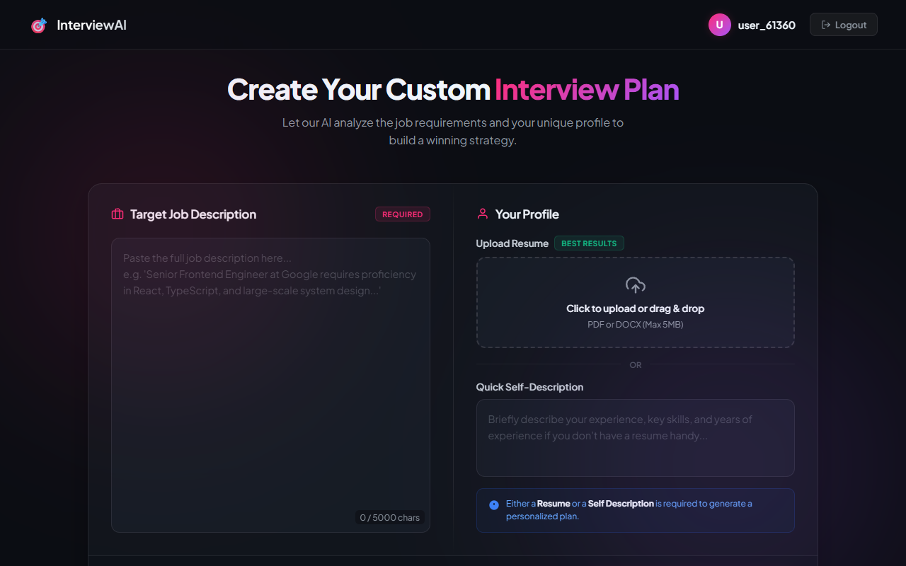
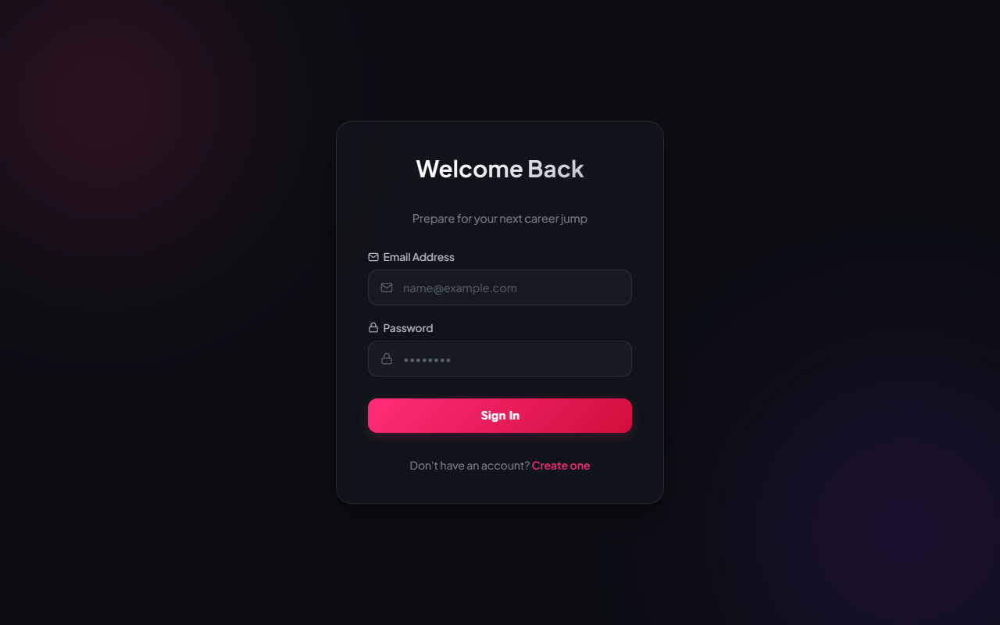
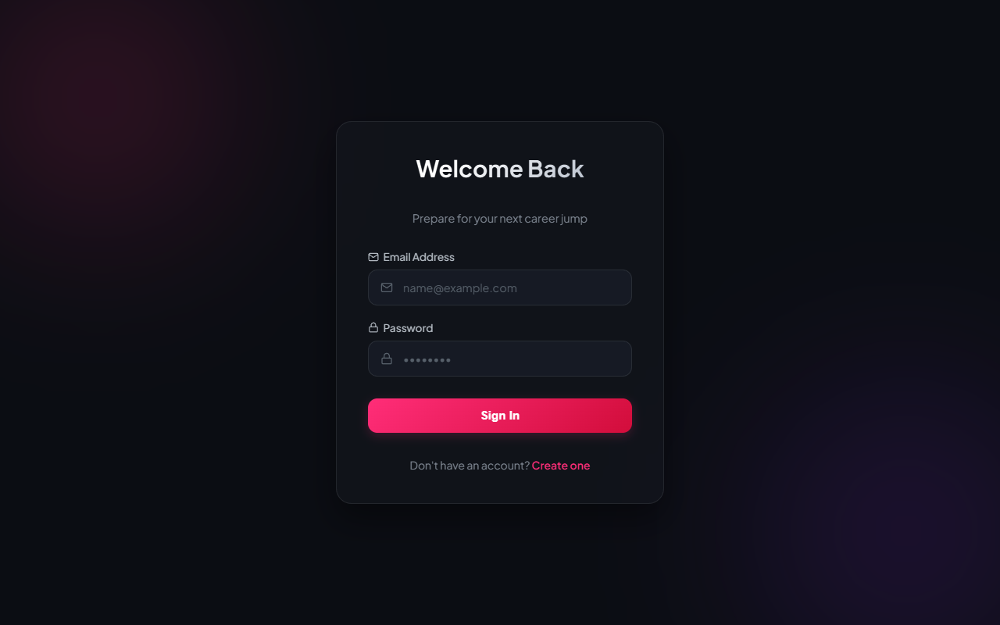
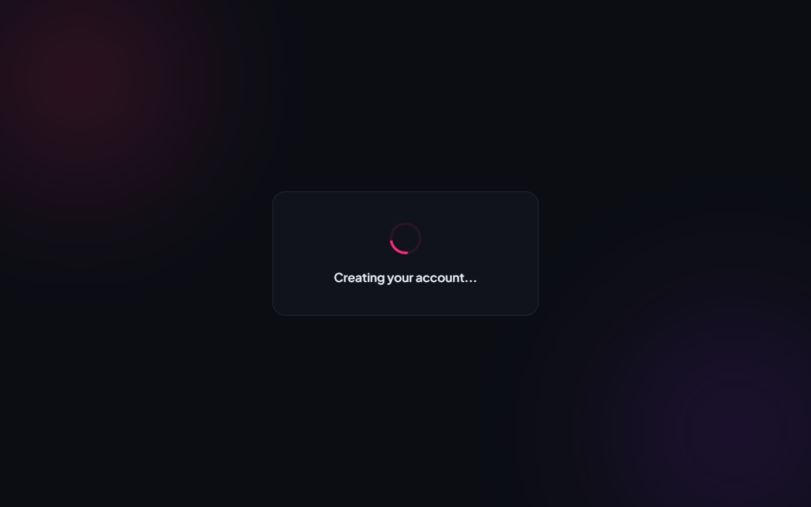

# 🎯 AI Interview Prep — Smart Career Coach

[](https://react.dev/)
[](https://nodejs.org/)
[](https://www.mongodb.com/)
[](https://deepmind.google/technologies/gemini/)
[](https://opensource.org/licenses/MIT)

An intelligent, full-stack web application designed to act as your personalized career coach. By analyzing your resume alongside a target Job Description, this system uses advanced AI (Google Gemini) to generate comprehensive interview preparation reports and dynamically create ATS-friendly tailored resumes.

---

## 🌐 Live Demo

*   **Frontend:** [https://ai-interview-prep-ten-tau.vercel.app](https://ai-interview-prep-ten-tau.vercel.app)
*   **Backend API:** [https://ai-interview-prep-chhk.onrender.com](https://ai-interview-prep-chhk.onrender.com)

---

## 🚀 Key Features

*   **Automated Resume Parsing:** Upload your PDF resume; the backend extracts and processes the text automatically.
*   **Intelligent Interview Prep Plan:** Generates a detailed report including:
    *   📊 **Match Score:** Calculates how well your resume fits the target Job Description.
    *   ❓ **Custom Questions:** Predicts technical and behavioral questions specific to *your* profile and the *target* role, including the interviewer's intention and the ideal answer approach.
    *   📉 **Skill Gap Analysis:** Identifies what you are missing and ranks severity.
    *   📅 **Day-wise Prep Plan:** A structured, day-by-day roadmap to prepare for the interview.
*   **Tailored Resume Generation:** Automatically generates a fully formatted, ATS-friendly PDF resume tailored exactly to the target job description.
*   **Persistent Dashboard:** Secure user authentication allows you to track and manage all your past applications and reports in one place.

---

## 📸 Application Preview

### 🖥️ Dashboard & Preparation Planner
Allows you to upload your resume, paste a target job description, or write a self-description to generate a customized strategy.


### 📊 Customized AI Prep Report
Displays your match score, severity-ranked skill gaps, custom technical and behavioral questions, and a day-by-day roadmap.


### 🔐 Redesigned Secure Authentication
Frosted glass card elements, animated ambient background blobs, and responsive interactive transitions.
| Sign In | Sign Up |
|---|---|
|  |  |

---

## 🛠️ Tech Stack

### Frontend
*   **React.js (Vite)**: Lightning-fast development server and optimized build bundling.
*   **React Router**: Handles routing and nested layouts.
*   **SCSS**: Advanced variables, mixins, nesting, and modular styles.
*   **Axios**: Manages asynchronous requests to the API.

### Backend
*   **Node.js & Express.js**: High-performance, scalable backend APIs.
*   **MongoDB & Mongoose**: NoSQL database for flexible storage of nested AI JSON reports.
*   **Multer**: Handles file uploading buffers in memory.
*   **PDF-Parse**: Extracts raw text content from uploaded resume PDFs.
*   **Puppeteer**: Headless browser rendering of HTML into high-quality downloadable PDF resumes.
*   **JWT & Bcryptjs**: Secure user authentication and password hashing.

### AI Integration
*   **Google Gemini SDK (`gemini-2.5-flash`)**: Drives profile analysis and report generation.
*   **Zod**: Enforces strict JSON schemas on AI output, guaranteeing reliable, type-safe frontend rendering.

---

## 💡 Architecture: How It Works

1.  **Input:** Client uploads a Resume (PDF) and enters a Job Description.
2.  **Parsing:** Backend `multer` stores the PDF in RAM, `pdf-parse` extracts the text.
3.  **AI Evaluation:** Backend sends the context to Gemini, strictly requesting output via a `Zod` JSON Schema.
4.  **Data Presentation:** The highly-structured JSON response is saved to MongoDB and returned to the React frontend for visual rendering.
5.  **PDF Engine:** If a tailored resume is requested, Gemini generates raw HTML. Node.js spins up `Puppeteer`, applies A4 sizing and exact margins, captures the render as a PDF buffer, and streams it down to the user for download.

---

## ⚙️ Local Installation & Setup

### Prerequisites
*   Node.js (v18+)
*   npm or yarn
*   MongoDB Atlas Account or local MongoDB Server

### 1. Clone the Repository
```bash
git clone https://github.com/hariomjaiswal12/AI-Interview-Prep.git
cd AI-Interview-Prep
```

### 2. Configure Backend
1. Navigate to the `Backend` directory:
   ```bash
   cd interview-ai/Backend
   ```
2. Install dependencies:
   ```bash
   npm install
   ```
3. Create a `.env` file in the `Backend` directory and define:
   ```env
   PORT=5000
   MONGO_URI=your_mongodb_connection_uri
   JWT_SECRET=your_jwt_signing_key
   GEMINI_API_KEY=your_google_gemini_api_key
   CLIENT_URL=http://localhost:5173
   ```
4. Start the backend server:
   ```bash
   npm run dev
   ```

### 3. Configure Frontend
1. Navigate to the `Frontend` directory:
   ```bash
   cd ../Frontend
   ```
2. Install dependencies:
   ```bash
   npm install
   ```
3. Create a `.env` file in the `Frontend` directory and define:
   ```env
   VITE_API_URL=http://localhost:5000
   ```
4. Start the frontend Vite development server:
   ```bash
   npm run dev
   ```
5. Open your browser and navigate to `http://localhost:5173`.

---

## 📄 License

This project is licensed under the MIT License. See the [LICENSE](LICENSE) file for details.
